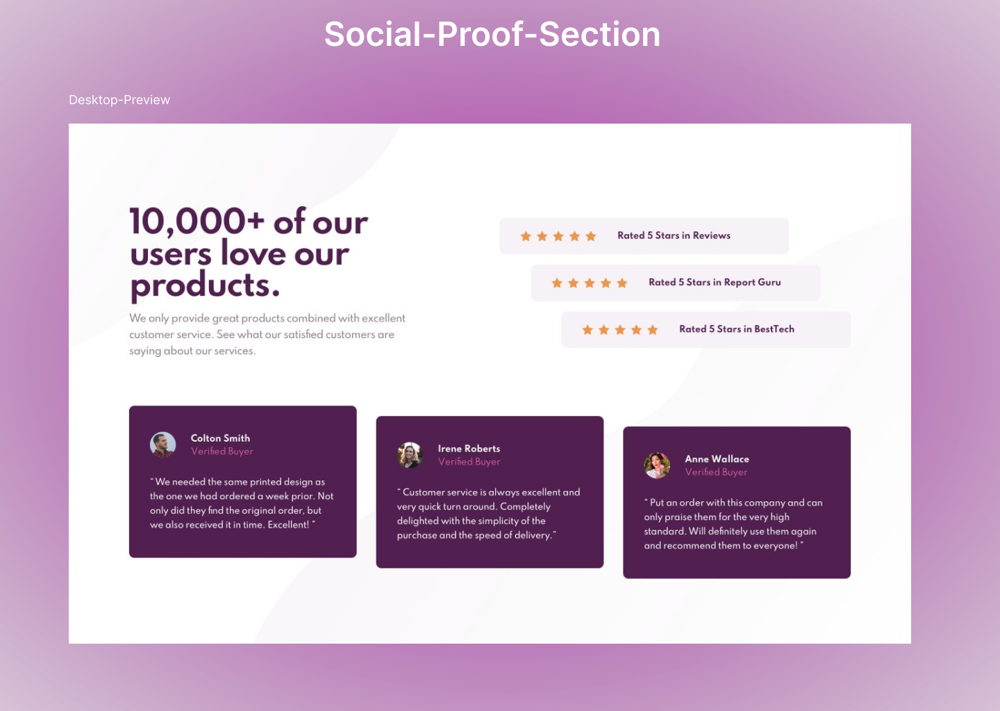

# Social-Proof-Section (flexbox)
   

## Hey there 👋, thanks for visiting.
  It contains my solution to "Frontend Mentor's" challenge which you can try [here](https://www.frontendmentor.io/challenges/coding-bootcamp-testimonials-slider-4FNyLA8JL).
  You need basic understanding of HTML,CSS and/or JS.

## Learnings
* Placing images(mainly background patterns) properly.
* Align cards as design.
